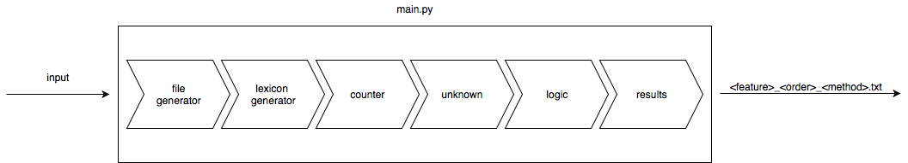

# nlsparql-wfst
The goal of the project is to develop Spoken Language Understanding (SLU) Module for Movie Domain using NL-SPARQL Dataset.
### Models
Two models have been developed: a basic model that ---- and an advanced model that ----. The model is automatically selected by _main.py_. To run the basic model, three parameters are needed:
1. the feature. It varies among 'word','pos','lemma'
2. the ngram order. An integer number
3. the ngram method. It varies among 'witten_bell','absolute','katz','kneser_ney','presmoothed','unsmoothed'
To run the advanced model, four parameters are needed:
1. the feature. It varies among 'word','pos','lemma'
2. the ngram order. An integer number
3. the ngram method. It varies among 'witten_bell','absolute','katz','kneser_ney','presmoothed','unsmoothed'
4. the advanced feature. It varies among 'word','pos','lemma'

To run the basic model, open a console, cd to wfst and launch
```
python main.py <feature> <ngram-order> <method>
```
for the basic model or
```
python main.py <feature> <ngram-order> <method> <advanced_feature>
```
for the advanced model.

### Dataset
The dataset can be found in `wfst/dataset`.

There are two training files and two testing files. The files named \*.data have been annotated using the [IOB notation](https://en.wikipedia.org/wiki/Inside–outside–beginning_(tagging). The others (\*.feats.txt) contain a tuple formed by the concept, the POS-tag, the lemma.
### Modules
The project is composed of the main file written in python and some other files which are shell scripts.

**main.py**

It is the entry point. Once the user runs this script, all the other files are called using `os.system`. Three parameters must be passed to the script:
1. the feature. It varies among 'word','pos','lemma'
2. the ngram order. An integer number
3. the ngram method. It varies among 'witten_bell','absolute','katz','kneser_ney','presmoothed','unsmoothed'
4. the advanced feature (**optional**). It varies among 'word','pos','lemma'
The pipeline followed by `main.py` is this:


**file_generator.sh**

it creates two _temp_ files: train.base and test.base. Both contain the following information separated by \\s:
* concept
* POS-tag
* lemma
* IOB-tag
* IOB-tag "-" concept
* IOB-tag "-" POS-tag
* IOB-tag "-" lemma

**lexicon_generator.sh**

using *ngramsymbols*, two _temp_ files are generated: concept.lex (concept lexicon) and feature.lex (feature lexicon)

**counter.sh**

To compute the weights (probabilities) of the final-state transducer concept instances, feature instances and \<concept, feature\> instances must be countered. This file takes care of this and it saves the results into three _temp_ files:
* feature_counter.txt
* concept_counter.txt
* feature_concept_counter.txt
Most of the code in this file has been provided by [Evgeny Stepanov, Ph.D.](http://sisl.disi.unitn.it/~estepanov/)

**unknown.sh**

Between the end of the execution of counter.sh and the beginning of this script, **main.py** takes care of generating an openfst-compatible file in order to generate the transducer. For simplicity, unknown.sh add some lines to the file generated by main.py concerning the OOV concepts.

**logic.sh**

It uses the openfst library to create the transducer.

**results.sh**

It generates a file which is compatible with [conlleval.pl](http://www.clips.uantwerpen.be/conll2000/chunking/)

Once the results are computed, the evaluation is stored in a file called \< feature \>\_\< ngramorder \>\_\< ngrammethod \>.txt that can be found in `wfst/results`.
Finally, it removes all the unecessary files
